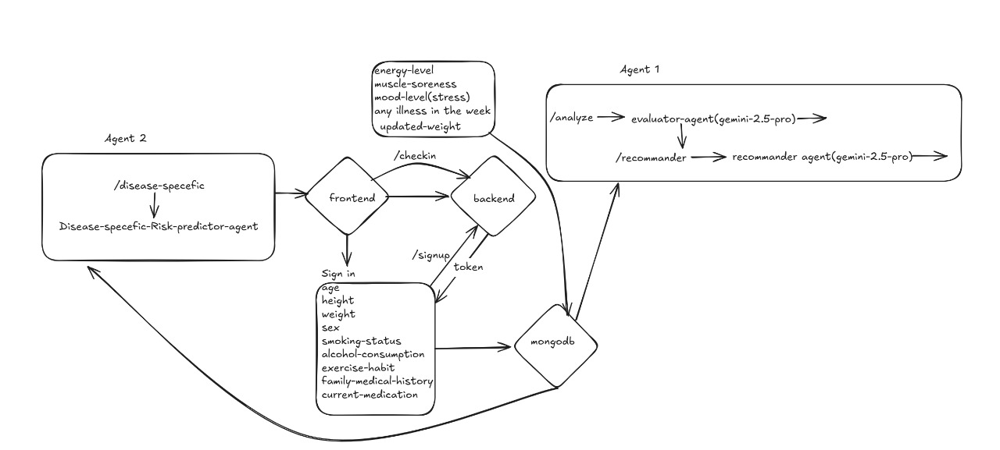

# 🌐 GlucoSense Frontend try 
## https://frontend-two-navy-46.vercel.app/
Modern **React + TypeScript** frontend for the **GlucoSense Health Monitoring Platform** — an intelligent system that bridges patients and doctors through AI-powered health insights.

---

## ✨ Overview

GlucoSense is a modern digital health application designed to:

- Empower **patients** to track daily health metrics and receive AI insights  
- Enable **doctors** to monitor multiple patients and generate analyses  
- Ensure **secure authentication** and **role-based dashboards**

---


## 🧱 System Architecture



### 🧩 Architecture Overview

The GlucoSense platform follows a **modular AI-driven architecture** that connects patients, doctors, and intelligent agents to provide real-time health insights.

1. **Frontend (React + Tailwind + Vite)**  
   - Handles all user interactions (login, signup, check-in).  
   - Communicates securely with the backend using API tokens.  
   - Displays analytics, insights, and dashboards.

2. **Backend (FastAPI + MongoDB)**  
   - Manages authentication, data storage, and API endpoints (`/signup`, `/checkin`, `/analyze`).  
   - Stores patient and doctor data in MongoDB.  
   - Routes data to specialized AI agents.

3. **Agent 1 – AI Evaluator & Recommender (Gemini-2.5-Pro)**  
   - Evaluates check-in data such as energy, stress, and muscle soreness.  
   - Generates recommendations and health summaries for patients and doctors.  
   - Operates under `/analyze` and `/recommander` endpoints.

4. **Agent 2 – Disease-Specific Risk Predictor**  
   - Predicts disease risks based on medical history and habits.  
   - Uses the `/disease-specific` route.  
   - Continuously updates patient profiles with risk insights.

5. **MongoDB Database**  
   - Stores structured user profiles, daily check-ins, and AI insights.  
   - Provides data for analytics and AI agents.  
   - Ensures persistent, secure data storage.

### 🔄 Data Flow Summary
- Users **sign up or log in** → receive a token.  
- Daily **check-in data** (mood, weight, soreness, illness) is sent to the backend.  
- Backend saves the data in **MongoDB** and triggers AI agents.  
- **Agent 1** analyzes user metrics and returns AI insights.  
- **Agent 2** predicts disease-specific risks and returns updated health risk levels.  
- All results are displayed on the frontend dashboards.

> 🧬 *This architecture ensures scalability, modular AI integration, and secure patient-doctor data management.*


## 🧩 Tech Stack

| Technology | Purpose |
|-------------|----------|
| **React 18 + Vite** | Fast, modular frontend development |
| **TypeScript** | Type-safe components and APIs |
| **Tailwind CSS** | Responsive, elegant UI styling |
| **React Router** | Navigation between pages |
| **Axios** | Backend communication |
| **Lucide React** | Modern icons |
| **PostCSS + ESLint** | Styling and linting standards |

---

## 🚀 Quick Start

### 1️⃣ Install dependencies
```bash
npm install
```

### 2️⃣ Start the development server
```bash
npm run dev
```
Your app will be running at **[http://localhost:3000](http://localhost:3000)**

### 3️⃣ Build for production
```bash
npm run build
```

---

## ⚙️ Configuration

All backend URLs are managed in:
```
src/config.ts
```

To update the API endpoint:
```ts
export const API_BASE_URL = 'http://13.62.57.143:8000';
```

Environment variables go in `.env` (copy `.env.example`).

---

## 👩‍⚕️ Demo Credentials

**Doctor**
- Email: `doctor@example.com`
- Password: `doctorpass`

**Patient**
- Register directly using the signup page.

---

## 🗂️ Directory Structure

```
aditya2311-del-frontend/
├── README.md
├── index.html
├── package.json
├── postcss.config.js
├── tailwind.config.js
├── tsconfig.json
├── tsconfig.node.json
├── vite.config.ts
├── .env.example
├── .eslintrc.cjs
└── src/
    ├── App.tsx
    ├── config.ts
    ├── index.css
    ├── main.tsx
    ├── components/
    │   ├── FormattedAnalysis.tsx
    │   ├── Layout.tsx
    │   └── ProtectedRoute.tsx
    ├── context/
    │   └── AuthContext.tsx
    ├── pages/
    │   ├── Login.tsx
    │   ├── Signup.tsx
    │   ├── doctor/
    │   │   ├── Dashboard.tsx
    │   │   ├── PatientDetail.tsx
    │   │   └── Patients.tsx
    │   └── patient/
    │       ├── CheckIn.tsx
    │       ├── Dashboard.tsx
    │       ├── Insights.tsx
    │       └── Profile.tsx
    ├── services/
    │   └── api.ts
    └── types/
        └── index.ts
```

---

## 📘 Project Highlights (Image-Based Walkthrough)

Each section below showcases a key part of the GlucoSense platform, with visuals stored in `/public`.

---

### 🧑‍💻 Signup Page
Patients and doctors can register using their email and password.  
The signup form includes role selection and validation.

📄 **Preview:**  
[View signup.pdf](./public/signup.pdf)

---

### 🩺 Daily Check-In Page
Patients log their daily metrics such as blood sugar level, energy, and symptoms.  
This data is analyzed by the AI model and shown in insights.

📄 **Preview:**  
[View checkin.pdf](./public/checkin.pdf)

---

### 📊 Patient Dashboard
Provides real-time insights into a patient’s health progress with clean data visualization.  
Graphs, recent logs, and AI interpretations are available here.

📄 **Preview:**  
[View p_dashboard.pdf](./public/p_dashboard.pdf)

---

### 💡 Health Insights
AI analyzes patient history and generates tailored recommendations, trends, and warnings.  
This helps both the patient and doctor make informed decisions.

📄 **Preview:**  
[View insight.pdf](./public/insight.pdf)

---

## 🔒 Role-Based Features

### 👨‍⚕️ Doctor Features
- View and manage patient lists
- Access patient histories
- Generate AI insights for treatment
- Search and filter patients by age or email
- Visual analytics dashboard

### 🧍 Patient Features
- Log daily health check-ins
- Track health improvements
- View personalized AI insights
- Update profile and medical details
- Access trends and predictions

---

## 🧠 Development Notes

- All HTTP calls go through `src/services/api.ts`
- Authentication tokens are securely stored in `localStorage`
- `ProtectedRoute.tsx` ensures role-based route access
- Built with modular and reusable components

---

## 📜 Available Scripts

| Command | Description |
|----------|--------------|
| `npm run dev` | Start local dev server |
| `npm run build` | Build production bundle |
| `npm run preview` | Preview production build |
| `npm run lint` | Lint and fix code |

---

## 💎 Design Principles

- **Responsive UI:** Tailwind ensures all pages adapt beautifully to screens of any size.  
- **Clean Layout:** Minimal, focused UI with meaningful visuals.  
- **Accessible Components:** Semantic HTML and ARIA-friendly components.  
- **Scalable Structure:** Organized modules for future feature extensions.

---

## 🧑‍💻 Contributors

**Frontend Developer:** [Aditya](https://github.com/aditya2311)  
**Project Mentor:** Team GlucoSense  
**License:** MIT

---

## 🩷 Screenshots Summary

| Page | Description | PDF Link |
|------|--------------|----------|
| Signup | New user registration page | [signup.pdf](./public/signup.pdf) |
| Check-In | Daily health update form | [checkin.pdf](./public/checkin.pdf) |
| Patient Dashboard | Overview of metrics and history | [p_dashboard.pdf](./public/p_dashboard.pdf) |
| Insights | AI-generated analysis | [insight.pdf](./public/insight.pdf) |

---

> 🧬 *GlucoSense – Empowering healthier lives through intelligent data.*
